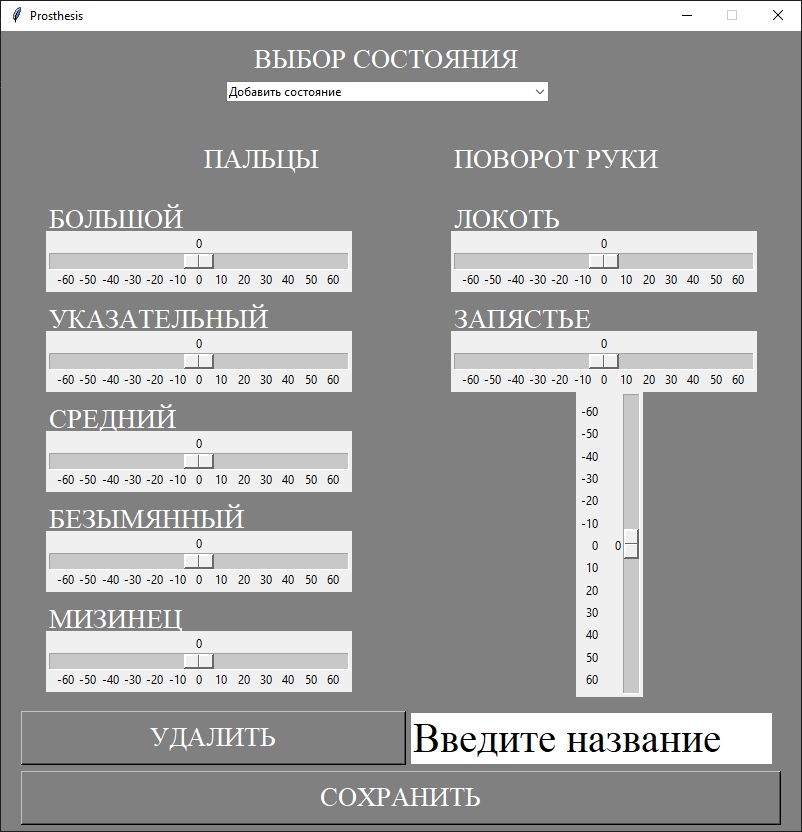

# Prosthesis
 

<b>RU</b> 
 Приложение на Tkinter для управление протезом руки на Arduino (модуль Arduino не подключен). 
 Все данные хранятся в БД на Вашем компьютере. 

<b>EN</b> 
 An application on Tkinter for controlling a prosthetic arm on an Arduino (the Arduino module is not connected). 
 All data is stored in a database on your computer. 
 
